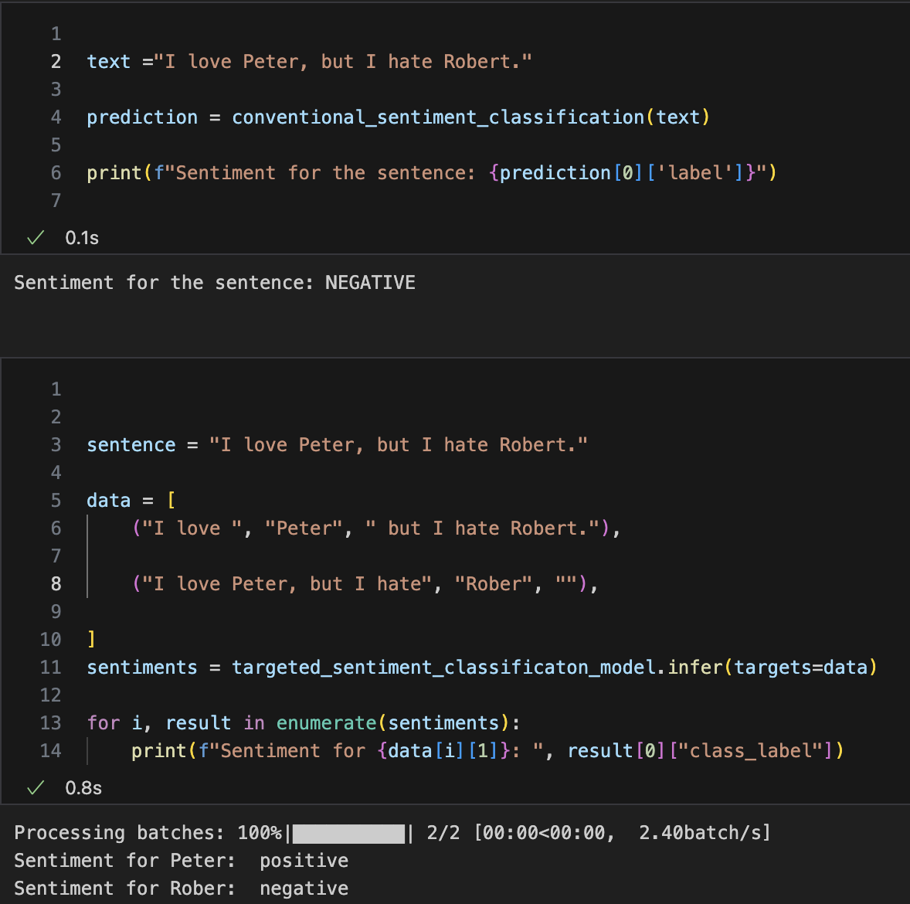
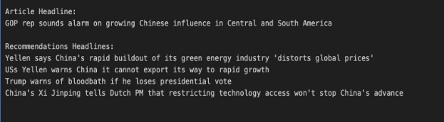

# News Lens
**A data-driven solution to address and overcome polarization in news.**

## Motivation

In an era where information is abundant, discerning the truth becomes increasingly challenging due to the pervasive bias present in news media. News Lens emerges as a pivotal tool in this landscape, offering a nuanced approach to exposing biases in various news sources without passing judgment. This project is motivated by the growing need for a platform that empowers users to form well-rounded opinions by providing recommendations for articles that present diverse viewpoints on the same topic. Related work in the field of media bias detection and recommendation systems has laid the groundwork, yet News Lens distinguishes itself by integrating advanced data science techniques to analyze and recommend content.

## Research Background

### Introduction to the CoNLL-2003 Shared Task: Language-Independent Named Entity Recognition

This paper outlines the CoNLL-2003 shared task focused on language-independent named entity recognition, covering both English and German datasets. The challenge drew participation from sixteen systems, with the highest performance achieved using a combination of Maximum Entropy Models, transformation-based learning, Hidden Markov Models, and robust risk minimization. Notably, the system also incorporated gazetteers and the output from two externally trained named entity recognizers to enhance its predictions. The study highlights variations in performance across different languages and discusses the significant error reduction achieved by some teams through the integration of external data sources. Despite these advancements, the paper emphasizes the ongoing need for methods that can effectively utilize vast amounts of unannotated raw text to improve named entity recognition (Sang & Meulder, 2003).

### MINILM: Deep Self-Attention Distillation for Task-Agnostic Compression of Pre-Trained Transformers

In response to the challenges posed by the large size of pre-trained Transformer models, this paper presents a method for compressing these models through deep self-attention distillation. The approach focuses on distilling the self-attention module of the last Transformer layer from a larger "teacher" model to a smaller "student" model. By utilizing the scaled dot-product of values in the self-attention module as a new form of knowledge, alongside traditional attention distributions, the authors achieve notable reductions in model size while retaining high accuracy. The distilled models maintain over 99% accuracy on challenging tasks such as SQuAD 20 and various GLUE benchmark tasks, using only 50% of the parameters and computational power of the original models. This method also shows promise for application to multilingual models, paving the way for more efficient deployment of Transformer-based models in resource-constrained environments (Wang et al., 2020).


### NewsMTSC: A Dataset for (Multi-)Target-dependent Sentiment Classification in Political News Articles

The paper introduces NewsMTSC, a novel dataset specifically designed for target-dependent sentiment classification (TSC) within the context of news articles—a domain where sentiment is often implied rather than explicitly stated. This dataset includes over 11,000 manually annotated examples and introduces a secondary test set for multi-target sentences to evaluate the influence of multiple sentiment targets within a single article. To address the challenges posed by longer texts and subtler expressions of sentiment, the authors propose a new model utilizing a Bidirectional Gated Recurrent Unit (BiGRU) in combination with multiple embeddings sourced from language models and external knowledge. This model, named GRU-TSC, significantly outperforms previous state-of-the-art models, demonstrating the efficacy of the approach and highlighting the unique challenges and requirements of applying TSC to political news content (Hamborg & Donnay, 2021).


## Problem Statement

News Lens seeks to address several critical questions:

- How can biases in news sources be exposed in a manner that is informative yet non-judgmental or reflective of our own biases?
- How can we use technology and data science to tackle or overcome this bias, thereby empowering the news audience to be well-informed in their opinions?

**The challenges lie in surgically detecting biases and overcoming them through diverse and opposing viewpoints.**

## Data Science Pipeline

1. **Data Scraper:** Utilizes scraping techniques to gather articles from diverse news sources covering various topics.
2. **Text Preprocessing:** Conducts basic text preprocessing for sentence tokenization.
3. **Sentence Tokenizer:** Splits each article into a list of sentences for further processing.
4. **Sentence Embedding Generation:** Employs an embedding model to generate vector representations for each article.
5. **NER Tagger:** Utilizes the BERT-based NER model to perform Named Entity Recognition on each sentence.
6. **Context Window Encoding:** Generates a context window around each NER tag, providing the tag itself along with the preceding and succeeding text.
7. **Target-Dependent Sentiment Classification (TSC):** Utilizes a RoBERTa model trained on the NewsMTSC dataset to predict the sentiment of each NER tag within its context window.
8. **Divergent Recommendation Engine:** Recommends four articles for each input article, covering similar topics while presenting diverse viewpoints, thus fostering a more comprehensive understanding of the subject matter.


## Methodology

### Scraping

The initial step in our pipeline is the **Data Scraper** to aggregate articles from a multitude of news sources. Utilizing APIs like newsapi.org, alongside scraping tools such as News-please, The scraper collects articles covering a wide array of topics. This diversity is crucial for constructing a dataset that is representative of the global news landscape, enabling our system to provide comprehensive insights across different perspectives.

### Text Preprocessing

Once articles are collected, the **Text Preprocessing** phase begins. This step is pivotal as it prepares the raw text data for sentiment analysis. Unlike conventional preprocessing methods that involve stop word removal, stemming, and lemmatization, our approach is tailored specifically for sentiment analysis. Research indicates that retaining the original structure of the text often yields better performance for the models we employ later in the pipeline, such as sentiment analysis and entity recognition models. Thus, preprocessing in News Lens is designed to clean and standardize the text without stripping away potentially valuable semantic information, thereby preparing it for sentence tokenization.

### Sentence Tokenizer

Following preprocessing, the **Sentence Tokenizer** segment splits articles into individual sentences. This granular level of analysis is necessary for our next steps, which require a sentence-by-sentence examination to accurately understand and evaluate the content.

### Embedding Model

The next stage, **Sentence Embedding Generation**, transforms each article into a vector representation using the MiniLM-L6-H384-uncased model, fine-tuned for our specific needs. These embeddings are crucial for capturing the semantic content of each article, facilitating cosine similarity between different articles used by our recommendation system later on.

### Named Entity Recognition

Our pipeline then incorporates an **NER Tagger**, specifically a BERT model fine-tuned on the CoNLL-2003 Named Entity Recognition dataset. This model identifies and categorizes key entities within each sentence, a step that is foundational for the context-specific analysis that follows. By recognizing named entities, we can more precisely analyze sentiment and bias concerning specific subjects, organizations, or individuals mentioned in the article.

### Context

**Context Window Encoding** follows, which constructs a context window around each identified NER tag. This process generates three tuples for each tag: the preceding text, the tag itself, and the succeeding text. This encoding is vital for Target-Dependent Sentiment Classification.

### Target-Dependent Sentiment Classification

**Target-Dependent Sentiment Classification (TSC)** provides a sentiment score for each entity in each statement considering the nuanced context needed to accurately assess sentiment towards each entity. The TSC model, a RoBERTa model trained on the NewsMTSC dataset, then predicts the sentiment of each entity based on its context window. This step is at the heart of our bias detection methodology, offering insights into how different entities are portrayed within the news articles.

#### Custom TSC Implementation
Our custom implementation builds upon the NewsMTSC dataset using a BERT-based architecture with a target-specific attention mechanism. The model combines a standard BERT base with a custom attention layer specifically designed for target focus, achieving 81% accuracy across negative, neutral, and positive classifications. The architecture employs a target attention layer to weigh the importance of different parts of the text relative to the target entity, followed by a multi-layer classification head for sentiment prediction. This approach has proven particularly effective for political news content, where sentiment is often subtly expressed through context rather than explicit language.

These snippets contrast conventional sentiment classification with Targeted Sentiment Classification (TSC). While conventional methods offer a single aggregated sentiment score for the entire sentence, TSC allows for targeted sentiment classification for each entity within the sentence. This aggregated sentiment score can serve as a proxy for bias.



### Divergent Recommendation Engine

The culmination of our analytical process is the **Divergent Recommendation Engine**. Designed to foster exposure to a broad range of perspectives, this engine operates in two phases.

The objective of this engine is to generate topic-wise relevant yet diverse articles that cover diverse viewpoints on the matter.

The engine is designed in two phases. First selects a number of topic-wise relevant articles, then from those articles select articles which are semantically divergent from the given article. *Note S>D*

Phase-1: Nearest Neighbor Generation: For each article, generate articles based on topic relevance.
- Generate a sparse one-hot encoded topic vector for each article based on the Named Entity Recognition (NER) tokens.
- Precompute the cosine similarity between each article and every other article.
- Given an article’s topic vector, select articles with the highest cosine similarity scores and return the indices of those articles from the precomputed cosine similarity matrix.

Phase-2: Semantic Divergent Generation: For each article, generate a number of articles based on maximizing semantic divergence.
- Generate embeddings for each article.
- For each article, find its embedding and compute the cosine angle with every other embedding.
- Return the indices of embeddings that are most perpendicular (i.e., have the least pairwise cosine similarity).

The following snippet depicts the headlines for 4 recommendations generated by the engine based on a given article's headline.



## Data Product
News Lens is a web app with two interfaces. The first presents users with the sentiment polarity of various news sources across different topics, derived from their past articles. This aggregated polarity serves as an indicator of the bias a news source might exhibit on a particular topic. The second interface allows users to explore different news articles, each highlighting the topic covered and its corresponding sentiment. Additionally, the app provides recommendations for each article, offering alternative perspectives on the same topic to help users form a more comprehensive opinion.

## Insights

- Experimenting with increasing the context window beyond one sentence has shown a detrimental effect on the accuracy of sentiment scores.
- Our recommendation engine exhibits optimal performance for political and sports news, suggesting a prevalence of diverse viewpoints within these genres compared to others.
- While topic modeling is a suitable algorithm for identifying article topics, its effectiveness diminishes as the number of topics increases. Additionally, as an unsupervised algorithm, it struggles with articles containing novel topics, often misclassifying them into existing topics, thereby compromising the system's ability to accurately identify bias.
- The notable contrast in performance between our system's conventional sentiment analysis model, which provides an overall sentiment of an article, and the targeted sentiment analysis model, capable of discerning sentiment for each entity, underscores the dynamic nature of news content. A single article can evoke a wide spectrum of sentiments towards different entities within it.

## Project Structure

```
├── CustomTargetDependentSentimentAnalysis/    # Custom sentiment analysis implementation
│   
├── End_to_End_Notebook/                       # End-to-end implementation notebooks
│
├── Result Analysis/                           # Analysis and evaluation results
│
├── portal/                                    # Web application
│   
│   
│
├── scraping/                                  # News article scraping scripts
│
├── topic_modeling/                            # Topic modeling implementation
│
├── config/                                    # Configuration files
│
├── Research-Papers/                           # Related research papers
│
├── images/                                    # Project images and diagrams
│
├── requirements.txt                           # Main project dependencies
└── newslens.yml                              # Environment configuration
```


## Environment Setup

### Setting up Virtual Environment

1. Clone the repository:
```bash
git clone https://github.com/yourusername/News-Lens.git
cd News-Lens
```

2. Create a virtual environment:
```bash
python -m venv venv
```

3. Activate the virtual environment:
- On macOS/Linux:
```bash
source venv/bin/activate
```
- On Windows:
```bash
.\venv\Scripts\activate
```

4. Install required packages:
```bash
pip install -r requirements.txt
```

## Further Improvements

- Integrate a summarizer module into News Lens to enhance its functionality. This module will extract key points and perspectives from multiple sources, ensuring they are mutually exclusive and collectively exhaustive (MECE). Subsequently, it will generate customized summaries for specific topics, thereby improving the overall user experience.
- Upgrade the system to handle real-time data processing, allowing for the inclusion of the latest news articles. This will ensure that the bias detection and recommendation systems are always up-to-date and reflective of current events.
- Develop a user profile system that can tailor recommendations and display biases based on individual user preferences and historical interactions. This personalization could increase user engagement and satisfaction.
- Increase the linguistic coverage of the system to include more languages, thereby broadening the user base and making the platform accessible to a global audience. This involves adapting the NER and sentiment analysis models to handle multiple languages effectively.

## Research Paper References

Hamborg, F., & Donnay, K. (2021). NewsMTSC: A Dataset for (Multi-)Target-dependent Sentiment Classification in Political News Articles. *EACL 2021 - Proceedings of the 2021 Conference of the European Chapter of the Association for Computational Linguistics*, 1-2. Retrieved from [https://aclanthology.org/2021.eacl-main.142.pdf ](https://aclanthology.org/2021.eacl-main.142.pdf)

Sang, E. F. Tjong Kim, & Meulder, F. De. (2003). Introduction to the CoNLL-2003 Shared Task: Language-Independent Named Entity Recognition. In *Proceedings of the Seventh Conference on Natural Language Learning at HLT-NAACL 2003 - Volume 4* (pp. 142-147). Association for Computational Linguistics.[ https://aclanthology.org/W03-0419.pdf ](https://aclanthology.org/W03-0419.pdf)

Wang, W., Wei, F., Dong, L., Bao, H., Yang, N., & Zhou, M. (2020). MINILM: Deep Self-Attention Distillation for Task-Agnostic Compression of Pre-Trained Transformers. *arXiv preprint arXiv:2002.10957*. Retrieved from[ https://arxiv.org/pdf/2002.10957.pdf ](https://arxiv.org/pdf/2002.10957.pdf)

